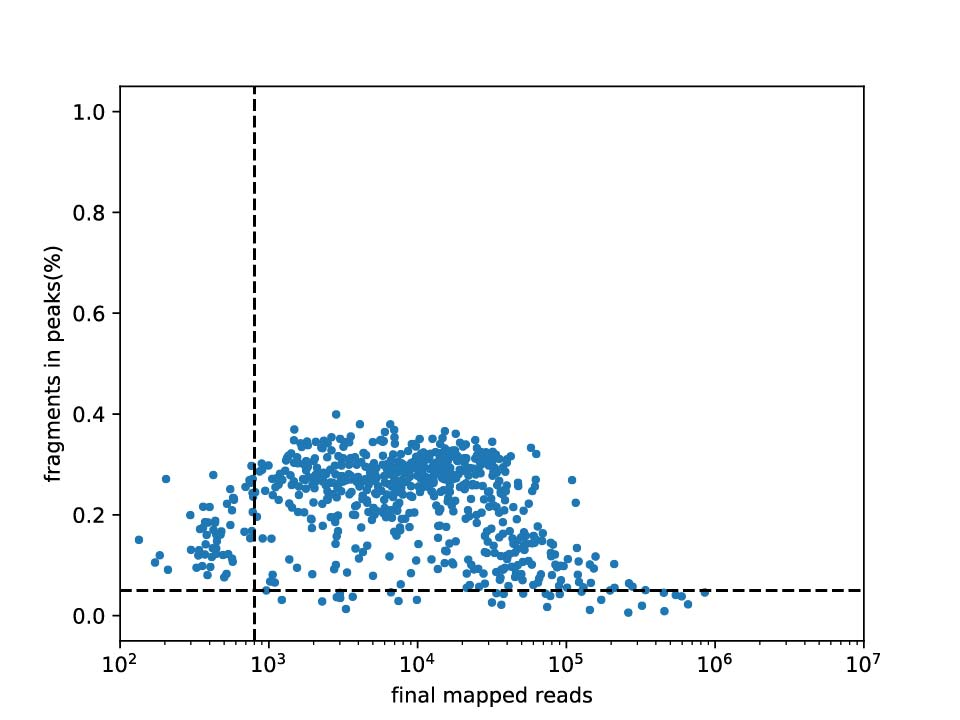
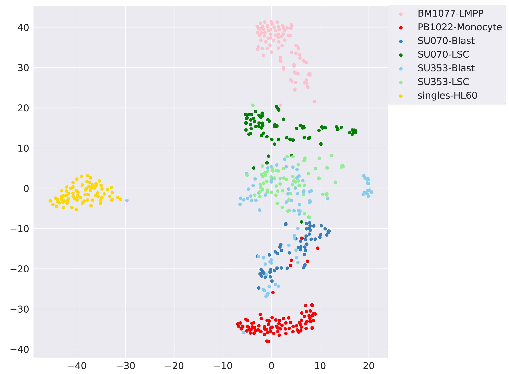

# User Guide for APEC

(Accessibility Pattern based Epigenomic Clustering)

## Introduction

APEC can perform fine cell type clustering on single cell chromatin accessibility data from scATAC-seq, snATAC-seq, sciATAC-seq or any other relevant experiment. It can also be used to control data quality, map fragment count matrices, search for important differential motifs/genes for each cell cluster, find super enhancers, and construct pseudo-time trajectory (by calling Monocle).

**If users want to process the raw fastq data from scATAC-seq experiment, please run APEC from section 2 “Fragment count matrix”. If users have their own fragment count matrix, where each element is the number of fragments per-cell-per-peak, please skip section 2 and run APEC from section 3 “Clustering”.**

For our example projects, most of APEC's results (including plots and dataframes) can be reproduced on a general computer system. For each APEC program, users can add the '-h' parameter to display an introduction to the input parameters.

## 1. Requirements and installation

### 1.1	Requirements

APEC requires users to use Linux system (CentOS 7.3+ or Ubuntu 16.04+), as well as Python (version 2.7.15+), Java (version 1.8.0+) and R (version 3.4+) environment. Users also need to install the latest version of the following packages (**All these pacakges can be installed by miniconda, as described in "Install_by_miniconda.md"**):

(1) Python packages and libraries:

    numpy, scipy, pandas, scikit-learn (0.20.0), multiprocessing, numba, pysam, matplotlib,
    seaborn, setuptools, networkx, python-louvain, python-Levenshtein.

    All upon python packages can be installed by: pip install package_name

Note: Please use scikit-learn 0.20.0 if you want to reproduce the tSNE plots of our example projects.

(2) R packages and libraries:

    Monocle 2.4.0: http://cole-trapnell-lab.github.io/monocle-release/

(3) Other necessory software:

All of the following software needs to be placed in the global environment of the Linux system to ensure that they can be called in any path/folder. Picard is also required, but we have placed it into $APEC/reference folder, and users don't need to install it. We recommend that users adopt the latest version of these software, except Meme (version 4.11.2). If users have their own fragment count matrix and only want to run APEC from section 3 "Clustering", then Bowtie2 and Macs2 are not required.

    Bowtie2: https://sourceforge.net/projects/bowtie-bio/files/bowtie2/2.2.9/
    Samtools: https://github.com/samtools/samtools
    Bedtools: http://bedtools.readthedocs.io/en/latest/content/installation.html
    Macs2: https://github.com/taoliu/MACS.git
    Meme 4.11.2: http://meme-suite.org/doc/download.html?man_type=web
    bedGraphToBigWig: http://hgdownload.soe.ucsc.edu/admin/exe/linux.x86_64/

### 1.2	Installation

Users simply completes the APEC installation by copying the APEC folder to any path on the computer (i.e. $APEC). There are two subfolders in APEC: a **code** folder (code_v1.0.1), which contains all APEC programs for data processing; a **reference** folder, which contains all necessary index and reference files for the hg19 and mm10 genomes. Users **must** run APEC program directly in $APEC/code/, since each program will invoke the reference files automatically. The **reference** folder is required for APEC and should be placed in the same path ($APEC) with the **code** folder. **But we didn't upload reference files to GitHub since they are too big. Users can download all reference files from http://galaxy.ustc.edu.cn:30803/APEC/**. If users have downloaded the **code** and **reference** folders, the installation will take less than 1 minute by moving them to the same path (i.e. $APEC). The **reference** folder should contains the following files:

    hg19_refseq_genes_TSS.txt, hg19_RefSeq_genes.gtf, hg19_blacklist.JDB.bed,
    hg19_chr.fa, hg19_chr.fa.fai, hg19.chrom.sizes,
    hg19.1.bt2, hg19.2.bt2, hg19.3.bt2, hg19.4.bt2,
    mm10_refseq_genes_TSS.txt, mm10_RefSeq_genes.gtf, mm10_blacklist.BIN.bed,
    mm10_chr.fa, mm10_chr.fa.fai, mm10.chrom.sizes,
    mm10.1.bt2, mm10.2.bt2, mm10.3.bt2, mm10.4.bt2,
    JASPAR2018_CORE_vertebrates_non-redundant_pfms_meme.txt, tier1_markov1.norc.txt

## 2. Fragment count matrix

### 2.1	Arrangement of raw data

Users need to build a project folder (i.e. $project), which contains a **data** folder, then copy all raw sequencing fastq files into the $project/**data**/ folder. All these pair-end fastq files should be named as:

    type1-001_1.fastq, type1-001_2.fastq, type1-002_1.fastq, type1-002_2.fastq, ……;
    type2-001_1.fastq, type2-001_2.fastq, type2-002_1.fastq, type2-002_2.fastq, ……;
    ……

where "\_1" and "\_2" indicate forward and backward reads for pair-end sequencing. {type1, type2, ...} can be cell-types or batches of samples, such as {GM, K562, ...}, or {batch1, batch2, ...}, or any other words without underline “\_” or dash “-”.
The **work**, **matrix**, **peak**, **result** and **figure** folders will be automatically built by subsequent steps, and placed in $project folder.

### 2.2	Easy-run of matrix preparation

Users can use the script ***APEC_prepare_steps.sh*** to finish the process from raw data to fragment count matrix.  This script includes steps of “trimming”, “mapping”, “peak calling”, “aligning read counts matrix”, “quality contral”, “estimating gene score”. Running this step on our example project (i.e. project01 with 672 cells) will take 10~20 hours on an 8-core 32 GB computer, since the sequence mapping step is the slowest step.

Example:

    bash APEC_prepare_steps.sh -s $project -g hg19 -n 4 -l 3 -p 0.2 -f 2000

Input parameters:

    -s: The project path, which should contain data folder before running APEC.
    -g: "hg19" or "mm10".
    -n: Number of CPU cores.
    -l: Threshold for the –log(Q-value) of peaks, used to filter peaks.
    -p: Threshold of the percentage of fragments in peaks, used to filter cells.
    -f: Threshold of the fragment number of each cell, used to filter cells.

Output files:

The script ***APEC_prepare_steps.sh*** will generate **work**, **peak**, **matrix**, and **figure** folders with many output files. Here, we only introduce files that are useful to users. For our example projects, all of these results can be reproduced on a general computer system.

(1) In **data** folder:

    cell_info.csv: Two-column list of cell information.

(2) In **work** folder:

For each cell, the mapping step can generate a subfolder (with cell name) in the **work** folder. There are several useful files in each subfolder:

    cell_name.hist.pdf: A histogram of fragment length distribution of each cell.
    cell_name.RefSeqTSS.pdf: Insert enrichment around TSS regions of each cell.

(3) In **peak** folder:

    mergeAll.hist.pdf: A histogram of fragment length distribution of all cells.
    mergeAll.RefSeqTSS.pdf: Insert enrichment around TSS regions of all cells.
    top_filtered_peaks.bed: Filtered top peaks, ranked by Q-value.
    genes_scored_by_peaks.csv: Gene scores evaluated by TSS peaks.

(4) In **matrix** folder:

    reads.csv: Fragment count matrix.
    cell_info.merged.csv: Data quality report of each cell.
    filtered_reads.csv: Filtered fragment count matrix.

(5) In **figure** folder:

    cell_quality.pdf: A scatter plot of the fragment number and the percentage of fragments in peaks.

_Figure 1. cell_quality.pdf in **figure** folder_

## 3.	Clustering

### 3.1	If users want to apply their own matrix

**Skip this step** if users have run ***APEC_prepare_steps.sh*** in Section 2 “Fragment count matrix” and generated fragment count matrix from the raw scATAC-seq data.

If users have their own fragment count matrix, please build **data**, **matrix**, **peak**, and **figure** folders in $project path, and place “cell_info.csv” file in **data** folder, “top_peaks.bed” in **peak** folder, “filtered_reads.csv” in **matrix** folder. Then users need to run script ***prepare_premappedMatrix.py*** before clustering and further analysis. This step will take about 60 minutes to run our example project (i.e. project02) on an 8-core 32 GB computer.

Example:

    python prepare_premappedMatrix.py -s $project --ref hg19 --fa $APEC/reference/hg19_chr.fa --np 4

Input parameters:

    -s:    The project path that contains data, work, matrix, peak, result and figure folders.
    --ref: "hg19" or "mm10".
    --fa:  The "hg19_chr.fa" or "mm10_chr.fa" file in the reference folder.
    --np:  Number of CPU cores.

Details about initial files:

    cell_info.csv: Two-column (separated by tabs) list of cell information, such as:
                        	name    notes
                        	CD4-001 CD4
                        	CD4-002 CD4
                        	CD8-001 CD8
                        	CD8-002 CD8
    top_peaks.bed: Three-column list of peaks (500 BP accessible regions), such as:
                        	chr1    3094060 3094560
                        	chr1    3094768 3095268
                        	chr1    3113480 3113980
                        	chr1    3119987 3120487
    filtered_reads.csv: Fragment count matrix, where each row is a cell and each column represents peak.
                        The name of cells should be same with “cell_info.csv”, and the order of peaks
                        should be same with “top_peaks.bed”. All numbers are separated by commas, for example:
				,peak0,peak1,peak2,peak3,peak4,peak5
			        CD4-001,1,0,2,0,0,1
			        CD4-002,0,1,0,0,2,0
			        CD8-001,0,0,0,1,1,0
			        CD8-002,2,1,0,0,0,1

### 3.2 Clustering based on accessons

To clustering cells by accessons, users can run the script ***cluster_byAccesson.py*** on the fragment count matrix. This step will take about 5 minutes to run our example projects (project01) on one single core of CPU if users run Louvain clustering only. Hierarchical clustering will be expensive for project with more than 3000 cells.

Example:

    Python cluster_byAccesson.py -s $project

Input parameters:

    -s:       The project path that contains data, work, matrix, peak, result and figure folders.
    --nc:     Number of cell clusters. If nc=0, it will be predicted by Louvain algorithm. default=0.
    --ngroup: Number of accessons, default=600.
    --norm:   score or probability; set normalization method, default=zscore.
    --hc:     Run hierarchical clustering or not, would be very slow for more than 3000 cells.
              If hc=no, only Louvain clustering will be applied. default=yes.

Output files important to users:

(1) In **result** folder:

    TSNE_by_Accesson.csv: tSNE transformation of accesson count matrix.
    louvain_cluster_by_Accesson.csv: Result of Louvain clustering.

(2) In **figure** folder:

    TSNE_by_Accesson.pdf: tSNE diagram of cells, colored by the “notes” column in $project/data/cell_info.csv.
    louvain_cluster_by_Accesson.pdf: Louvain clustering result of cells, plotted on tSNE map.

(3) In **matrix** folder:

    Accesson_reads.csv: Accesson fragment count matrix.
    Accesson_peaks.csv: Peaks that labeled by corresponding accesson.

_Figure 2. TSNE_by_Accesson.pdf in **figure** folder_

### 3.3 Clustering based on motifs (same as chromVAR)

The script ***cluster_byMotif.py*** provides a python version of motif-based cell clustering, with the same algorithm as chromVAR. This step will take about 30 minutes to run our example projects (project01) on a 8-core CPU.

Example:

    python cluster_byMotif.py -s $project --ns 50 --np 8 --nc 0 --space pca

Input parameters:

    -s:      The project path that contains data, work, matrix, peak, result and figure folders.
    --ns:    Number of permuted samplings to calculate the bias-corrected deviations of motifs.
             Its default value is 50.
    --np:    Number of CPU cores.
    --nc:    Number of cell clusters. If nc=0, it will be predicted by Louvain algorithm. default=0.
    --hc:    Run hierarchical clustering or not, would be very slow for more than 3000 cells.
             If hc=no, only Louvain clustering will be applied. default=yes.

Output files description:

(1) In **result** folder:

TSNE_by_chromVAR.csv and louvain_cluster_by_chromVAR.csv are similar to the results in Section 3.2, except that they are generated by motif-based clustering (same as chromVAR). And deviation_chromVAR.csv is the bias corrected deviation matrix generated by chromVAR algorithm.

(2) In **figure** folder:

TSNE_by_chromVAR.pdf and louvain_cluster_by_chromVAR.pdf are similar to the results in Section 3.2, except that they are generated by motif-based clustering (same as chromVAR).

### 3.4 Clustering comparison

Users can run ***cluster_comparsion.py*** to measure the accuracy of the clustering algorithm by comparing its result with known FACS cell indexes, or to compare the clustering results of two different algorithms.

Example:

    python cluster_comparison.py --c1 $project/data/cell_info.csv
                                 --c2 $project/result/louvain_cluster_by_Accesson.csv

Input parameters:

    --c1: "cell_info.csv" file in data folder, or "cluster_by_XXX.csv" in result folder.
    --c2: Cell clustering result file different with c1.

The output information will be directly printed on the screen, including the contingency matrix and the ARI (adjusted rand index) value.

## 4. Feature analysis

### 4.1 Differential peaks, motifs and genes

Example:

    python generate_differential_markers.py -s $project
                                            --cfile $project/result/louvain_cluster_by_Accesson.csv
                                            --cluster 1 --vs 2,3 --motif yes --gene yes

Input parameters:

    -s:        The project path.
    --cfile:   The cluster.csv file of a clustering method, e.g. $project/result/louvain_cluster_by_Accesson.csv
    --cluster: The target cluster for differential markers analysis, can be 0, 1, 2, …, or a batch of
               clusters like “0,2”.
    --vs:      vs which clusters users search differential markers for target cluster, e.g. “1,3”. default=all.
    --pvalue:  P-value threshold for differential markers, default=0.001.
    --fold:    Fold change cutoff of differential markers, default=2.
    --motif:   Whether to search differential motifs, default=no.
    --gene:    Whether to search differential genes, default=no.

Output files:

In **result** folder, users can see three types of output files: “peaks_of_cluster_XXX.csv”, “genes_of_cluster_XXX.csv”, and “motifs_of_cluster_XXX.csv”, which respectively list the differential peaks, genes, and motifs of one cell-cluster (vs all other clusters or a batch of clusters).

### 4.2 Pseudo-time trajectory

Example:

    python generate_trajectory.py -s $project --npc 5
                                  --cfile $project/data/cell_info.csv

Input parameters:

    -s:      The project path.
    --npc:   Number of principle components used for pseudo-time trajectory, defaul=5.
    --cfile: Cell-types file, e.g. $project/data/cell_info.csv or $project/result/louvain_cluster_by_Accesson.csv.
    --dim:   Plot 2D or 3D trajectory, default=3.
    --angle: Angles to rotate the 3D trajectory, default=“30,30”.

Output files:

This script can generate “monocle_reduced_dimension.csv” and “monocle_trajectory.csv” in **result** folder, and “pseudotime_trajectory.pdf” in **figure** folder. These files depict the structured data and 3D image for pseudo-time trajectory respectively.

### 4.3 Marker motif/gene plot

Example:

    python generate_markers_on_plots.py -s $project
                                        --cfile $project/result/TSNE_by_Accesson.csv
                                        --type motif --name RELA

Input parameters:

    -s:      The project path.
    --cfile: “TSNE_by_Accesson.csv” or “monocle_reduced_dimension.csv” file (in result folder) to render
             the enrichment of marker gene/motif.
    --type:  Type of marker, can be “motif” or “gene”.
    --name:  Name of marker.
    --angle: Angles to rotate the 3D trajectory, default=“30,30”.

Output files:

Depending on the type of marker (motif or gene) and diagram (tSNE or pseudo-time trajectory), users will find different output plots in **figure** folder:

    motif_XXX_on_TSNE_by_Accesson.pdf
    gene_XXX_on_TSNE_by_Accesson.pdf
    motif_XXX_on_monocle_reduced_dimension.pdf
    gene_XXX_on_monocle_reduced_dimension.pdf

### 4.4 UCSC track

The program "generate_UCSCtrack.py" is not available if users have their own fragment count matrix and run APEC from section 3 "Clustering".

Example:

    python generate_UCSCtrack.py -s $project --cfile $project/result/louvain_cluster_by_Accesson.csv
                                 --gsize $APEC/reference/hg19.chrom.sizes

Input parameters:

    -s: The project path.
    --cfile: The cell clustering result file, e.g. “louvain_cluster_by_Accessons.csv” file in $project/result/ folder.
    --gsize: The chromosome lengths file, i.e. “hg19.chrom.sizes” or “mm10.chrom.sizes” in $APEC/reference/ folder

Output files:

This script will generate several .bw files in $project/result/track/ folder, and each .bw file is named by its corresponding cell-cluster. Other files (.bam, .bedgraph) in this folder can also be helpful if users want to know more details about the genome-wide fragment count for each cell-cluster.

### 4.5 Super enhancer

Example:

    python generate_superEnhancer.py -s $project

Input parameters:

    -s: The project path.

Output files:

The “potential_super_enhancer.csv” in **result** folder shows the adjacent peaks belonging to the same accesson, and their genomic regions. Users need to check the .bw files of the cell-clusters on the UCSC track browser to confirm the super enhancer regions.
