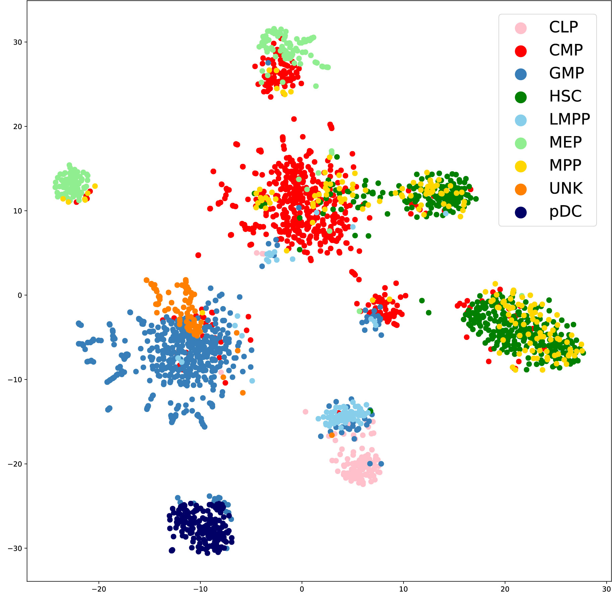

# User Guide for APEC (v1.2.2)

(Accessibility Pattern based Epigenomic Clustering)

APEC can perform fine cell type clustering on single cell chromatin accessibility data from scATAC-seq, snATAC-seq, sciATAC-seq or any other relevant experiment. It can also be used to evaluate gene expression from relevant accesson, search for differential motifs/genes for each cell cluster, find super enhancers, and construct pseudo-time trajectory (by calling Monocle). **If users have already obtained the fragment-count-per-peak matrix from other mapping pipelines (such as CellRanger), please run APEC from [Section One "Run APEC from fragment count matrix"](#section-one-run-aepc-from-fragment-count-matrix). If users have only the raw fastq files, please jump to [Section Two "Get fragment count matrix from raw data"](#section-two-get-fragment-count-matrix-from-raw-data).**

## Section One. Run AEPC from fragment count matrix

### 1. Requirements and installation

#### 1.1 Requirements

APEC requires Linux system (CentOS 7.3+ or Ubuntu 16.04+), as well as Python3 (3.6.8, not 3.7.x) and R (3.5.1+) environments. If users want to build pseudotime trajectory with APEC, please install Monocle (2.10.0, http://cole-trapnell-lab.github.io/monocle-release/docs/) in R (see [1.2 Install and import APEC](#12-install-and-import-apec)). Also, the following softwares are required for APEC if users want to run motif analysis (as chromVAR):

    Bedtools: http://bedtools.readthedocs.io/en/latest/content/installation.html
    Meme 4.11.2: http://meme-suite.org/doc/download.html?man_type=web (Meme 5.x.x is not compatible with APEC)

The files in **reference** folder are required for APEC. But we didn't upload reference files to GitHub since they are too big. Users can download all reference files from one of the following websites:

-|website
-|-
1|http://galaxy.ustc.edu.cn:30803/APEC/reference/   Due to server upgrades, this site will be temporarily unavailable from 2020-03-30 to 2020-04-01.
2|https://apec.oss-us-east-1.aliyuncs.com/APEC/reference/reference.zip
3|https://drive.google.com/drive/folders/1psK7za4KNJfqpigUaLMY3bWlqBHp1J5k?usp=sharing

The **reference** folder should contains the following files:

    hg19_RefSeq_genes.gtf, hg19_chr.fa, hg19_chr.fa.fai,
    mm10_RefSeq_genes.gtf, mm10_chr.fa, mm10_chr.fa.fai,
    JASPAR2018_CORE_vertebrates_non-redundant_pfms_meme.txt, tier1_markov1.norc.txt

#### 1.2 Install and import APEC

Users can install APEC by:

    pip install APEC==1.2.2

We strongly recommend that users build a python 3.6.8 environment for APEC with **miniconda** or **anaconda**, since APEC is dependent on specific versions of python packages (see README.md in examples folder), and Monocle (2.10.0) can be installed in conda environment too. The commands to create a conda environment (named as apec_env) and install APEC and Monocle are:

    conda create -n apec_env python=3.6.8
    conda activate apec_env
    pip install APEC==1.2.2
    conda install -n apec_env -c bioconda bioconductor-monocle=2.10.0

In Ipython, Jupyter-notebook or a python script, users can import packages of APEC by:

    from APEC import clustering,plot,generate

Users can inquire the manual for each function of APEC by using "help()" in Ipython or Jupyter, for example:

    help(clustering.cluster_byAccesson)

### 2. Input data

If users have employed APEC to generate fragment count matrix from raw data (see [Section Two](#section-two-get-fragment-count-matrix-from-raw-data)), they can run AEPC clustering and subsequent analysis on the $project folder directly.

If using APEC for 10X scATAC-seq data, users can run the following script to prepare the project:

    from APEC import convert
    convert.convert_10X('$10X_data_folder/', '$project/')

The '$10X_data_folder' should contain 'barcodes.tsv', 'matrix.mtx' and 'peaks.bed' files, which are the results of Cellranger.

If using the matrix generated from other experiments, users need to prepare a project folder (termed '$project'), which contains **matrix** and **peak** folders. Please place "filtered_cells.csv" and "filtered_reads.mtx" in **matrix** folder, "top_filtered_peaks.bed" in **peak** folder. Here is the instruction for three input files:

    filtered_cells.csv: Two-column (separated by tabs) list of cell information ('name' and 'notes'):
                        The 'name' column stores cell names (or barcodes).
                        The 'notes' column can be cell-type or any other cell information.
    top_filtered_peaks.bed: Three-column list of peaks, which is a standard bed format file.
                            It is same to the "peaks.bed" file in the CellRanger output of a 10X dataset.
    filtered_reads.mtx: Fragment count matrix in mtx format, where a row is a peak and a column is a cell.
                        It is same to the "matrix.mtx" file in the CellRanger output of a 10X dataset.
                        The order of cells should be the same with "filtered_cells.csv".
                        The order of peaks should be the same with "top_filtered_peaks.bed.

### 3. Functions of APEC (step by step)

#### Users can directly run example projects and scripts in "examples" folder to generate figures listed in our APEC paper (https://www.biorxiv.org/content/10.1101/646331v4).

#### 3.1 Clustering by APEC

Use the following codes to cluster cells by APEC algorithm:

    clustering.build_accesson('$project', ngroup=600)
    clustering.cluster_byAccesson('$project', nc=0, norm='probability')
    plot.plot_tsne('$project', rs=0)
    plot.correlation('$project', cell_label='notes', clip=[0,1])

input parameters:

    ngroup:   Number of accessons, default=600.
    nc:       Number of cell clusters, set it to 0 if users want to predict it with APEC, default=0.
    norm:     Normalization method, can be 'zscore', 'probability', or 'filter'; default='probability'.
              If there are many noises in the fragment count matrix, please consider to set norm='filter'.
    rs:             The random_seed parameter for tSNE, default=0.
    cell_label:     Color labels for cells, can be 'notes' or 'cluster', default='notes'.
                    If cell_label='cluster', it will use clustering result of clustering.cluster_byAccesson().
    clip:           Range [min, max] for the correlation heatmap, default=[-1,1]

output files:

    $project/matrix/Accesson_peaks.csv
    $project/matrix/Accesson_reads.csv
    $project/result/cluster_by_APEC.csv
    $project/result/TSNE_by_APEC.csv
    $project/figure/TSNE_by_APEC_with_notes_label.pdf
    $project/figure/TSNE_by_APEC_with_cluster_label.pdf
    $project/figure/cell_cell_correlation_by_APEC_with_notes_label.png

_Figure A. TSNE_by_APEC_with_notes_label.pdf, where cells are labeled with cell types (the 'notes' column of filtered_cells.csv)_

_Figure B. TSNE_by_APEC_with_cluster_label.pdf, where cells are labeled with cell clusters (the 'cluster' column of cluster_by_APEC.csv)_

#### 3.2 Clustering by chromVAR (optional, required for motif analysis)

Use the following codes to cluster cells by chromVAR algorithm:

    generate.motif_matrix('$project', genome_fa='$reference/hg19_chr.fa',
                          background='$reference/tier1_markov1.norc.txt',
                          meme='$reference/JASPAR2018_CORE_vertebrates_redundant_pfms_meme.txt',
                          np=4)
    clustering.cluster_byMotif('$project', np=4, nc=0, ns=50)

input parameters:

    genome_fa:   Path to hg19_chr.fa or mm10_chr.fa in $reference folder.
    background:  Path to tier1_markov1.norc.txt in $reference folder.
    meme:        Path to JASPAR2018_CORE_vertebrates_redundant_pfms_meme.txt in $reference folder.
    np:          Number of CPU cores used for parallel calculation, default=4.
    nc:          Number of cell clusters, set it to 0 if users want to predict it using Louvain algorithm, default=0.
    ns:          Number of permuted sampling, default=50.

output files:

    $project/result/deviation_chromVAR.csv
    $project/result/cluster_by_chromVAR.csv

#### 3.3 Evaluate ARI, NMI and AMI for clustering result

If users have the real cell type in the 'notes' column of '$project/matrix/filtered_cells.csv', please use the following code to calculate ARI, NMI and AMI to estimate the accuracy of the clustering algorithm.

    clustering.cluster_comparison('$project/matrix/filtered_cells.csv',
                                  '$project/result/cluster_by_APEC.csv',
                                  exclude='UNK')

The output ARI, NMI and AMI values will be printed on the screen directly. Please make sure that the column 'notes' of filtered_cells.csv denotes the cell type of each cell. For some datasets, such as the hematopoietic cells, the user should exclude all "UNK" cells (unknown type) before the calculation of ARI.

#### 3.4 Generate pseudotime trajectory

By default, APEC adapts monocle to generate pseudotime trajectory from accesson matrix:

    generate.monocle_trajectory('$project', npc=5)
    plot.plot_trajectory('$project', cell_label='notes', angles=[30,30])

input parameters:

    npc:            Number of principal components used to build trajectory, default=5.
    cell_label:     Labels for cells, can be 'notes' or 'cluster', default='notes'.
    angles:         Rotation angles for 3D trajectory, e.g. [100,20], default=[30,30].

output files:

    $project/result/monocle_trajectory.csv
    $project/result/monocle_reduced_dimension.csv
    $project/figure/pseudotime_trajectory_with_notes_label.pdf

_Figure C. pseudotime_trajectory_with_notes_label.pdf_

#### 3.5 Generate gene expression

    generate.gene_score('$project', genome_gtf='hg19_RefSeq_genes.gtf', distal=20000)

output file:

    $project/matrix/genes_scored_by_TSS_peaks.csv
    $project/peak/genes_TSS_peaks.csv

#### 3.6 Generate differential feature for a cell cluster

Get differential accessons:

    generate.get_nearby_genes('$project')   # optional. Users should run step 3.5 before this.
    generate.differential_feature('$project', feature='accesson', target='0', vs='all')

Get differential motifs/genes:

    generate.differential_feature('$project', feature='motif', target='0', vs='all')
    generate.differential_feature('$project', feature='gene', target='0', vs='all')

input parameters:

    feature:     Type of feature, can be 'accesson' or 'motif' or 'gene', default='accesson'.
                 If feature='accesson', run step 3.1 first;
                 if feature='motif', run step 3.2 first;
                 if feature='gene', run step 3.5 first.
    cell_label:  Cell Labels used for differential analysis, can be 'notes' or 'cluster', default='cluster'.
    target:      The target cluster that users search for differential features, default='1'.
                 If cell_label='cluster', target is one element in the 'cluster' column of cluster_by_APEC.csv file;
                 if cell_label='notes', target is one element in the 'notes' column of filtered_cells.csv file.
    vs:          Versus which clusters, can be '2,3,4' or 'all', default='all' (means all the rest clusters).
    pvalue:      P-value for student-t test, default=0.01.
    log2_fold:   Cutoff for log2(fold_change), default=1.

output file:

    $project/result/differential_accesson_of_cluster_X_vs_XXX.csv
    $project/result/differential_motif_of_cluster_X_vs_XXX.csv
    $project/result/differential_gene_of_cluster_X_vs_XXX.csv

#### 3.7 Plot motif/gene on tSNE/trajectory diagram

    plot.plot_feature('$project', space='tsne', feature='gene', name='FOXO1')
    plot.plot_feature('$project', space='trajectory', feature='motif', name='GATA1')

input parameters:

    space:          In which space we draw the feature, can be 'tsne' or 'trajectory', default='tsne'.
                    If space='tsne', run plot.plot_tsne() first;
                    if space='trajectory', run step 3.4 first.
    feature:        Type of the feature, can be 'accesson' or 'motif' or 'gene', default='accesson'.
                    If feature='accesson', run step 3.1 first;
                    if feature='motif', run step 3.2 first;
                    if feature='gene', run step 3.5 first.
    name:           Name of the feature.
                    If feature='accesson', name=accesson number, i.e. '1';
                    if feature='motif', name=motif symbol, i.e. 'GATA1';
                    if feature='gene', name=gene symbol, i.e. 'CD36'.
    clip:           Clip range for the input matrix, can be [min, max] or 'none', default='none'.
    angles:         Rotation angles for 3D trajectory, e.g. [100,20], default=[30,30].

output files:

    $project/figure/motif_XXX_on_trajectory_by_APEC.pdf
    $project/figure/gene_XXX_on_tsne_by_APEC.pdf

_Figure D. motif_GATA1_on_trajectory_by_APEC.pdf_

#### 3.8 Generate potential super enhancer

    generate.super_enhancer('$project', super_range=1000000, p_cutoff=0.01)

input parameter:

    super_range:    Genome range to search for super enhancer, default=1000000.
    p_cutoff:       Cutoff of P-value, default=0.01.

output file:

    $project/result/potential_super_enhancer.csv

## Section Two. Get fragment count matrix from raw data
### (This part is only available on GitHub:https://github.com/QuKunLab/APEC)

### 1. Requirements and installation

All of the following software needs to be placed in the global environment of the Linux system to ensure that they can be called in any path/folder. Picard is also required, but we have placed it into $APEC/reference folder, and users don't need to install it. We recommend that users adopt the latest version of these software, except Meme (version 4.11.2).

    Bowtie2: https://sourceforge.net/projects/bowtie-bio/files/bowtie2/2.2.9/
    Samtools: https://github.com/samtools/samtools
    Bedtools: http://bedtools.readthedocs.io/en/latest/content/installation.html
    Macs2: https://github.com/taoliu/MACS.git
    Meme 4.11.2: http://meme-suite.org/doc/download.html?man_type=web
    pysam for python: set up by "pip install pysam"
    Levenshtein for python: set up by "pip install python-Levenshtein"

#### 1.2	Installation

Users can simply install this part by copying the **code_v1.1.0** folder and **reference** folder into a same path. Users **must** run ***APEC_prepare_steps.sh*** directly in code_v1.1.0/, since each program will invoke the reference files automatically. The **reference** folder is required, but we didn't upload reference files to GitHub since they are too big. Users can download all reference files from one of the following sites:

-|website
-|-
1|http://galaxy.ustc.edu.cn:30803/APEC/reference/   Due to server upgrades, this site will be temporarily unavailable from 2020-03-30 to 2020-04-01.
2|https://apec.oss-us-east-1.aliyuncs.com/APEC/reference_full.zip.001   https://apec.oss-us-east-1.aliyuncs.com/APEC/reference_full.zip.002   https://apec.oss-us-east-1.aliyuncs.com/APEC/reference_full.zip.003

 The **reference** folder should contains the following files:

    hg19_refseq_genes_TSS.txt, hg19_RefSeq_genes.gtf, hg19_blacklist.JDB.bed,
    hg19_chr.fa, hg19_chr.fa.fai, hg19.chrom.sizes,
    hg19.1.bt2, hg19.2.bt2, hg19.3.bt2, hg19.4.bt2, hg19.rev.1.bt2, hg19.rev.2.bt2,
    mm10_refseq_genes_TSS.txt, mm10_RefSeq_genes.gtf, mm10_blacklist.BIN.bed,
    mm10_chr.fa, mm10_chr.fa.fai, mm10.chrom.sizes,
    mm10.1.bt2, mm10.2.bt2, mm10.3.bt2, mm10.4.bt2, mm10.rev.1.bt2, mm10.rev.2.bt2,
    JASPAR2018_CORE_vertebrates_non-redundant_pfms_meme.txt, tier1_markov1.norc.txt, picard.jar

### 2. Fragment count matrix

#### 2.1	Arrangement of raw data

The **raw_data** folder should contain all raw sequencing fastq files into the. All these pair-end fastq files should be named as:

    type1-001_1.fastq, type1-001_2.fastq, type1-002_1.fastq, type1-002_2.fastq, ……;
    type2-001_1.fastq, type2-001_2.fastq, type2-002_1.fastq, type2-002_2.fastq, ……;
    ……

where "\_1" and "\_2" indicate forward and backward reads for pair-end sequencing. {type1, type2, ...} can be cell-types or batches of samples, such as {GM, K562, ...}, or {batch1, batch2, ...}, or any other words without underline "\_" or dash "-".
Users need to build a **project** folder to store the result. The **work**, **matrix**, **peak** and **figure** folders will be automatically built by subsequent steps, and placed in **project** folder.

#### 2.2	Easy-run of matrix preparation

Users can use the script ***APEC_prepare_steps.sh*** to finish the process from raw data to fragment count matrix.  This script includes steps of "trimming", "mapping", "peak calling", "aligning read counts matrix", and "quality contral". Running this step on our example project (i.e. project01 with 672 cells) will take 10~20 hours on an 8-core 32 GB computer, since the sequence mapping step is the slowest step.

Example:

    bash APEC_prepare_steps.sh -r $raw_data -s $project -g hg19 -n 4 -l 3 -p 0.2 -f 2000

Input parameters:

    -r: The raw_data folder
    -s: The project folder.
    -g: "hg19" or "mm10".
    -n: Number of CPU cores.
    -l: Threshold for the –log(Q-value) of peaks, used to filter peaks.
    -p: Threshold of the percentage of fragments in peaks, used to filter cells.
    -f: Threshold of the fragment number of each cell, used to filter cells.

Output files:

The script ***APEC_prepare_steps.sh*** will generate **work**, **peak**, **matrix**, and **figure** folders with many output files. Here, we only introduce files that are useful to users. For our example projects, all of these results can be reproduced on a general computer system.

(1) In **work** folder:

For each cell, the mapping step can generate a subfolder (with cell name) in the **work** folder. There are several useful files in each subfolder:

    cell_name.hist.pdf: A histogram of fragment length distribution of each cell.
    cell_name.RefSeqTSS.pdf: Insert enrichment around TSS regions of each cell.

(2) In **peak** folder:

    mergeAll.hist.pdf: A histogram of fragment length distribution of all cells.
    mergeAll.RefSeqTSS.pdf: Insert enrichment around TSS regions of all cells.
    top_filtered_peaks.bed: Filtered top peaks, ranked by Q-value.

(3) In **matrix** folder:

    reads.csv: Fragment count matrix.
    cell_info.merged.csv: Data quality report of each cell.
    filtered_cells.csv: Filtered cells information in csv format.
    filtered_reads.mtx: Filtered fragment count matrix in mtx format.

(4) In **figure** folder:

    cell_quality.pdf: A scatter plot of the fragment number and the percentage of fragments in peaks.

### 3. Generate bigwig files for UCSC track

    generate_UCSCtrack.py -s $project --cfile cluster.csv --gsize chrom.sizes

    Options:
      -s             The project folder.
      --cfile        cluster.csv file, e.g. cluster_by_APEC.csv in
                     $project/result/ folder
      --gsize        chrom.size files, default=../reference/hg19.chrom.sizes

This script outputs bigwig files to $project/result/track/ folder.
